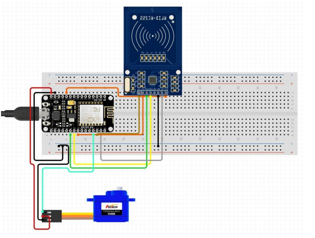

# IoT-Based Smart Parking System 

An intelligent, IoT-enabled parking management system designed to streamline urban parking challenges. Our project utilizes sensors and microcontrollers to detect vehicle presence, display slot availability in real-time, and provide users with a smarter parking experience.

##  Features

-  **IoT-Driven Slot Monitoring**  
  Uses ultrasonic sensors to detect whether parking slots are occupied.

-  **Real-Time Slot Availability**  
  Live status updates are shown via LEDs or display screens.

-  **Wireless Data Transmission**  
  Slot data is transmitted using Wi-Fi/Bluetooth modules (e.g., ESP8266, NodeMCU).

-  **User Interface (Optional)**  
  Basic web/mobile UI to show slot availability (if implemented).

-  **Scalable & Modular**  
  Easily extendable for more slots or advanced features like payment & reservation.

-  **Security with RFID**  
  Scans the ID of a person and regulates the entry and exit of people.

-  **Pre Booking of Parking Slots**  
  Easily pre book a parking slot and pay based on the amount of time you park at a spot.

---

##  Technologies Used

- **Hardware**  
  - Ultrasonic Sensors (HC-SR04)  
  - ESP8266 / NodeMCU Microcontroller  
  - LEDs for slot indication  
  - Jumper wires, breadboard, power supply

- **Software**  
  - Arduino IDE  
  - Embedded C / Arduino C++  
  - Website: HTML/CSS for UI, Blynk/ThingSpeak for visualization

---

##  Getting Started

### 1. Hardware Setup
- Place ultrasonic sensors at each parking slot.
- Connect sensors to the microcontroller (ESP8266).
- Connect indicator LEDs to show slot status.
- Power up your setup using a USB cable or external power.

### 2. Code Upload
- Open the Arduino IDE.
- Install the required libraries for ESP8266.
- Upload the code to the board via USB.
- Configure your Wi-Fi credentials inside the code.

### 3. Test the System
- Place objects (simulate cars) in slots.
- Observe sensor readings and LED behavior.
- Monitor output via Serial Monitor or optional dashboard.

---

## 📷 Demo & Snapshots
 
>  Circuit Diagrams | Parking Lot Model | Working Model Demo Link  

###  Circuit Diagrams

###  Parking Lot Model

###  Working Model Demo Link

---

## Future Enhancements

-  Mobile app for booking slots
-  Payment gateway integration
-  Data analytics for slot usage patterns
-  GPS-enabled lot locator
-  Security with RFID or License Plate Recognition

---
